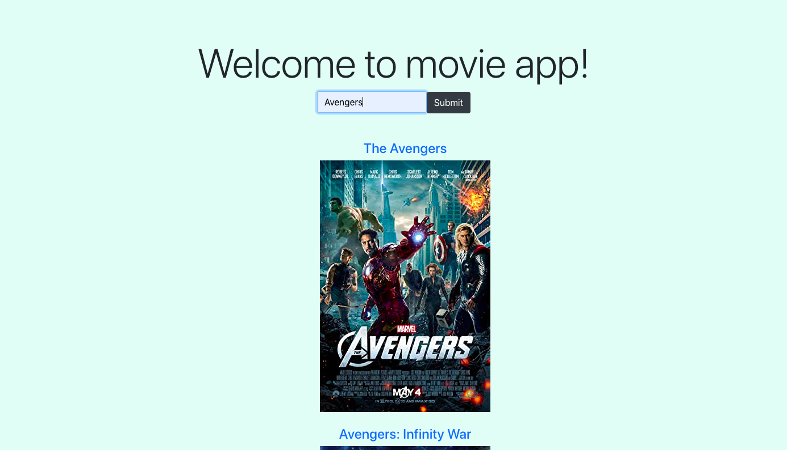

# Movieapp

Movieapp is an app that allows users to search a movie title, look through results and select a movie. Users are able to go to the movie page and see additional information about the movie. 

Built with React.js, Node.js with Express, PostgreSQL, and bootstrap.

## Features

Users are able to:

* Search for a movie title.
* Click on the movie title for more information. 
* Give a movie a thumbs up or thumbs down.

## Technologies Used

* React.js. For the front-end/client interface of the app.
* Node.js & Express.js. For the HTTP backend server.
* PostgreSQL. As the relation database management system.
* Bootstrap. For the styling of the app.

##  Local Setup

You must have installed Node.js and PostgreSQL in your computer.

You can check for these dependencies with node -v and psql -v. If your shell/terminal doesn't complain and you see version numbers you are good to go.

1. Clone this repo: 
  
   git clone git@github.com/tbriany/movieapp.git 

2. Install dependencies for the Node/Express Server (backend folder):

   cd server && npm install

3. Install dependencies the React App (frontend folder):

   cd client && npm install

4. Create database and seed sample data while being in the server directory with:
 
   psql -f .db/seed.sql
   Make sure PostgreSQL is running!

5. To launch the Node/Express server, inside the backend folder run:
 
   npm run start:dev
 
6. To launch the React App, inside the frontend folder, and preferably in another terminal window run:
 
   npm start
 
A new browser tab should have been opened and the App should be running. If that is not the case check the terminals output for errors, if you are unable to troubleshoot the problem, I would be happy to address issues so open one
